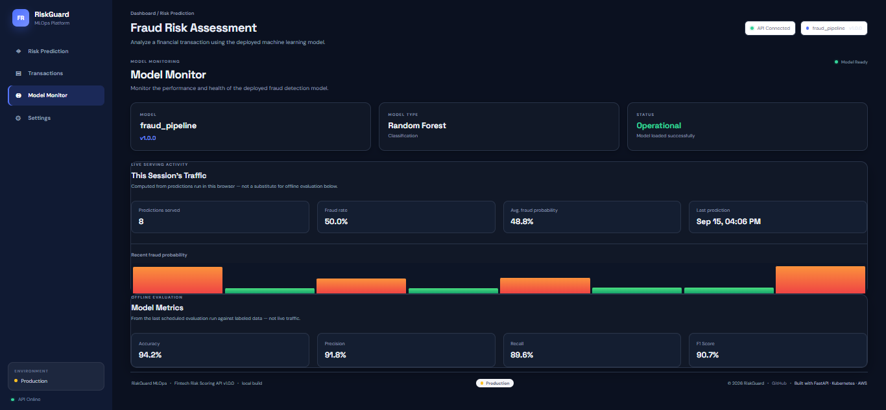

# RiskGuard — Fintech Fraud Risk Scoring MLOps Platform
[](https://github.com/RohitDusane/riskguard-fraud-detection/actions/workflows/ci.yml)


A fraud-risk scoring service built to demonstrate the full engineering
lifecycle around a machine learning model — not just training one, but
serving it, containerizing it, orchestrating it, monitoring it, and
deploying it to the cloud with a real CI/CD pipeline.

The project is intentionally **cost-conscious**: it runs on a single AWS
EC2 instance with K3s rather than a managed Kubernetes control plane,
because that's the honest, defensible architecture for a project at this
stage — not because it's a compromise being hidden.

---


---

## What's actually running

```
GitHub
   |
   v
GitHub Actions (OIDC — no stored AWS keys)
   |
   +---- lint + pytest
   +---- kubeconform (manifest validation)
   +---- docker buildx (arm64) + Trivy scan
   |
   v
Amazon ECR
   |
   v
AWS EC2 (t4g.small, Graviton/ARM, ap-south-1)
   |
   v
K3s (single node, Traefik built-in)
   |
   +------------------+------------------+
   |                                     |
   v                                     v
FastAPI (risk-mlops-api, 2 replicas)     Prometheus + kube-state-metrics
   |                                     |
   v                                     v
Random Forest model (fraud_pipeline)     Alertmanager -> Slack
                                          |
                                          v
                                         Grafana
```

No NAT Gateway, no Application Load Balancer, no RDS — each of those adds
$15-35/month for capability this project doesn't need yet. Total
infrastructure cost: **~$16-18/month** on-demand.

---

## Technology stack

| Layer | Technology |
|---|---|
| Language | Python 3.12 |
| API | FastAPI + Uvicorn |
| ML | scikit-learn (RandomForestClassifier), joblib |
| Containerization | Docker (multi-stage, non-root, arm64) |
| Orchestration | Kubernetes (K3s) |
| Cloud | AWS (EC2, ECR) |
| CI/CD | GitHub Actions (OIDC to AWS, no stored credentials) |
| Metrics | Prometheus, kube-state-metrics |
| Alerting | Alertmanager → Slack |
| Dashboards | Grafana |
| Testing | Pytest, Locust (load testing) |
| Frontend | Static HTML/CSS/JS dashboard (RiskGuard UI) |

---

## Dependency management

- `requirements-serving.txt` — minimal runtime deps baked into the production Docker image (kept small deliberately)
- `requirements-dev.txt` — testing, linting, and local dev tools (pytest, ruff, locust)
- `requirements.txt` — full pinned environment for local development
- `pyproject.toml` — project metadata and tool config (ruff, pytest settings)

---

## Repository structure
K3s ships with Traefik as its built-in ingress controller, so the two
`traefik-*.yaml` files configure HTTPS termination (Let's Encrypt) and
redirect middleware directly through K3s rather than standing up a
separate ingress controller or an AWS ALB.

```
## Repository structure

risk-mlops/
├── app/
│   ├── main.py                    # FastAPI app, lifespan model loading, Prometheus instrumentation
│   ├── api/routes.py              # /api/v1/health, /ready, /predict
│   ├── core/config.py             # pydantic Settings
│   ├── services/model_service.py  # ModelService: load/predict/unload
│   └── frontend/                  # RiskGuard static dashboard (index.html, style.css, script.js)
│
├── models/
│   └── fraud_pipeline.joblib
│
├── tests/
│   ├── conftest.py                # mocks ModelService for API contract tests
│   ├── test_health.py             # liveness vs readiness contract
│   ├── test_api.py                # predict endpoint
│   ├── test_model_service.py
│   └── locustfile.py              # load test script
│
├── k8s/
│   ├── namespace.yaml
│   ├── configmap.yaml
│   ├── deploy.yaml
│   ├── service.yaml
│   ├── traefik-middlewares.yaml          # HTTPS redirect / header middleware for the built-in Traefik ingress
│   ├── traefik-letsencrypt-config.yaml   # TLS cert resolver config (Let's Encrypt via Traefik)
│   └── monitoring/
│       ├── monitoring-prometheus.yaml            # Prometheus deployment + service
│       ├── monitoring-prometheus-config.yaml     # Prometheus scrape config (alerts.yml, targets)
│       ├── monitoring-alertmanager.yaml          # Alertmanager deployment + Slack routing
│       ├── monitoring-kube-state-metrics.yaml    # scoped to deployments/pods only
│       ├── monitoring-grafana.yaml               # Grafana deployment + service
│       ├── monitoring-grafana-datasource.yaml    # Grafana → Prometheus datasource provisioning
│       ├── monitoring-grafana-dashboard-provider.yaml
│       └── prometheus-monitor.yaml               # ServiceMonitor / scrape target for the API
│
├── monitoring/
│   ├── prometheus/alerts.yml            # 18 alert rules (source, mounted into monitoring-prometheus-config)
│   ├── alertmanager/alertmanager.yml.template
│   └── grafana/{provisioning,dashboards}/
│
├── .github/workflows/ci.yml       # lint -> test -> validate -> build/scan/push -> SSM deploy
├── Dockerfile                     # multi-stage, arm64-ready, non-root (uid 10001)
├── docker-compose.yaml            # local dev: api + prometheus + grafana
├── RUNBOOK.md                     # full local-to-production deployment walkthrough
├── requirements.txt
├── requirements-serving.txt
├── requirements-dev.txt
└── docs/
    ├── project-overview.md
    ├── architecture.md
    ├── api.md
    ├── model.md
    └── deployment.md
```

---

## Running locally

```bash
uvicorn app.main:app --host 0.0.0.0 --port 8000
```

- App: `http://localhost:8000`
- Swagger: `http://localhost:8000/docs`
- Health: `http://localhost:8000/api/v1/health`
- Readiness: `http://localhost:8000/api/v1/ready`

### Docker Compose (API + Prometheus + Grafana)

```bash
docker compose up --build
```

### Local K3s

```bash
sudo k3s kubectl apply -f k8s/namespace.yaml
sudo k3s kubectl apply -f k8s/configmap.yaml
sudo k3s kubectl apply -f k8s/deploy.yaml
sudo k3s kubectl apply -f k8s/service.yaml
sudo k3s kubectl get pods -n risk-mlops
```

Full step-by-step, including the AWS production path, is in
[`RUNBOOK.md`](./RUNBOOK.md).

---

## Testing

```bash
pip install -r requirements-dev.txt
pytest --cov=app --cov-report=term-missing
ruff check .
locust -f tests/locustfile.py --host http://localhost:8000
```

---

## Monitoring & alerting

Prometheus scrapes the API's `/metrics` endpoint (via
`prometheus-fastapi-instrumentator`) and kube-state-metrics (scoped to
`deployments` and `pods` only — least-privilege, not the full default
resource set). **18 alert rules** cover API availability, error rate,
p95 latency, model drift/accuracy metrics, and Kubernetes-level failure
modes (OOMKilled, pod restart loops, unavailable replicas). Alertmanager
routes `critical` vs `warning` severities to separate Slack channels.

---

## Honest current limitations

These are real, not hedging boilerplate:

- **Single EC2 node, no HA.** A node failure takes the whole deployment
  down. Multi-AZ + ALB + ASG is the upgrade path, at roughly 2x the cost.
- **Model evaluation metrics are placeholders.** `model_accuracy`,
  `model_prediction_drift`, etc. are instrumented and alertable, but no
  scheduled evaluation job has populated real values yet — this is
  tracked as a known gap, not hidden.
- **ECR pull tokens expire every 12 hours** on this single-node setup
  (no IRSA-style credential provider like EKS has). A refresh CronJob is
  the planned fix.
- **Transaction history in the frontend is browser-local** (`localStorage`),
  not backend-persisted — fine for a demo, not for multi-user use.

---

## Documentation

- [Project Overview](docs/project-overview.md)
- [Architecture](docs/architecture.md)
- [API Reference](docs/api.md)
- [Model Details](docs/model.md)
- [Deployment Guide](docs/deployment.md)
- [Full Runbook](RUNBOOK.md) — end-to-end local-to-production walkthrough

---

## Credits & inspiration

The fraud/risk-scoring concept was inspired by
[Amir Hossein Honardoust's Financial Fraud Risk Engine](https://github.com/AmirhosseinHonardoust/Financial-Fraud-Risk-Engine).
This project extends that concept into a full MLOps deployment
architecture (containerization, Kubernetes, CI/CD, cloud deployment,
observability) rather than the original modeling scope.

## Disclaimer

Educational and portfolio project. Predictions from this system should
not be used for real financial, lending, or fraud decisions without
proper validation, governance, and regulatory review.
